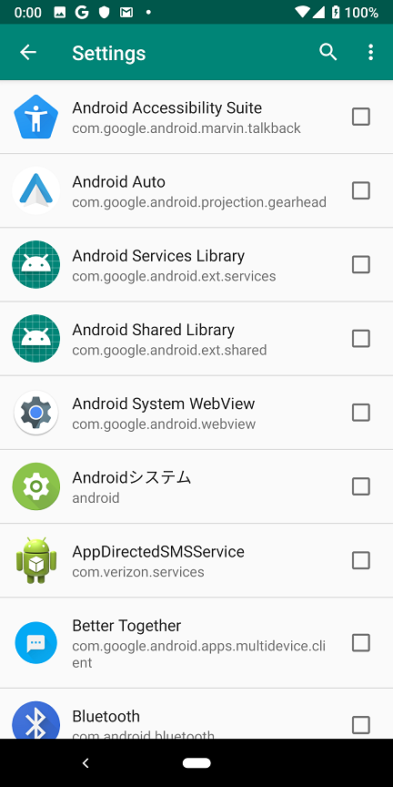
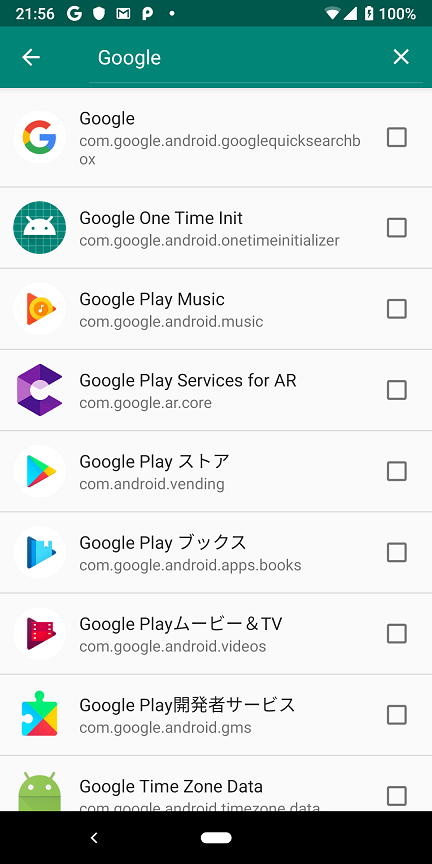
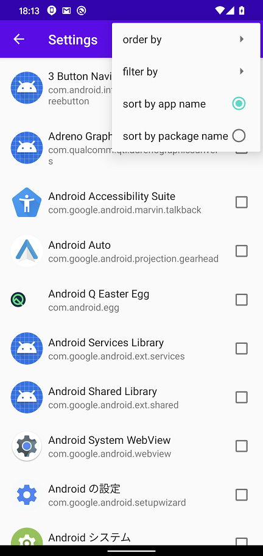

Android 通信 Proxy 設定ツール
=============

Language/[English](https://github.com/raise-isayan/TunProxy/blob/master/Readme.md)

このツールは、Android の VPNService 機能を利用した Proxy 設定ツールです。
指定したアプリからの通信のみを取得することが可能です。

## 使用方法

ユーザ証明書領域に信頼させたい Root CA がない場合はインストールします。

TunProxyアプリを起動すると以下の画面が起動します。

* Proxy address (ipv4:port)
  * 接続先のプロキシサーバを **IPv4アドレス:ポート番号** の形式で指定します。
     IPアドレスはIPv4形式で記載する必要があります。

* [Start] ボタン
  * 接続を開始します。
* [Stop] ボタン
  * 接続を停止します。

## メニュー

画面上部のメニューアイコン()からアプリケーションの設定ができます。

### Settings

VPNの接続設定を行います。

 ⇒ 

Disallowed Application と Allowed Application の２つのモードがありますが、同時に指定することはできません。
このためどちらのモードで動作させたいかを選択する必要があります。
デフォルトは **Disallowed Application** が選択された状態です。

* Disallowed Application
  * VPN通信から除外したいアプリを選択する。
    選択したアプリはVPN通信を経由されなくなり、VPNを利用しない場合と同じ挙動となります。

* Allowed Application
  * VPN通信を行いたいアプリを選択する。
    選択したアプリはVPN通信を経由するようになります。
    選択されていないアプリは、VPNを利用しない場合と同じ挙動になります。
    なお、一つも選択されていない場合は、すべてのアプリの通信がVPNを経由します。

* Clear all selection
  * Allowed / Disallowed Application のすべての選択をクリアします。

### Settings 検索

 / 

画面上部の検索アイコン()から、アプリケーションを絞り込めます。
アプリケーション名に指定したキーワードを含む、アプリケーションのみが表示されます。

プリケーションリストは、画面上部のメニューアイコン()からソートできます。

* sort by app name
  * アプリケーション名でアプリケーションリストを並べ替えます。

* sort by package name
  * パッケージ名でアプリケーションリストを並べ替えます。

* order by asc
  * 昇順にソートします

* order by desc
  * 降順にソートします

### MITM (SSL 復号化)

TunProxyはSSL復号化を実行しません。TunProxyは透過プロキシのように機能します。

SSL復号化を実行するには、Burp suite や Fiddler などのSSLを復号化可能なローカルプロキシツールのIPをTunProxyのIPに設定します

SSLを復号化可能なローカルプロキシツールとしては次に記載するものがあります。

* Burp suite
  * https://portswigger.net/burp

* Fiddler
  * https://www.telerik.com/fiddler

* ZAP Proxy
  * https://www.owasp.org/index.php/OWASP_Zed_Attack_Proxy_Project

SSLを復号化するには、ローカルプロキシツールのRoot証明書をAndroid端末のユーザ証明書にインストールしてください。
ただし、Android 7.0 以降において、デフォルトではユーザ証明書を信頼しなくなっています。

* https://android-developers.googleblog.com/2016/07/changes-to-trusted-certificate.html

解決策として次のWebサイトを参照してください。

* Android 7 Nougatおよび認証局
  * https://blog.jeroenhd.nl/article/android-7-nougat-and-certificate-authorities

### About
アプリケーションバージョンを表示します。

## 動作環境 

* Android 5.0 (API Level 21) 以降

## 謝辞

アプリ作成にあたりコードの大部分は以下のアプリをベースとして作成しました。

* forked from MengAndy/tun2http
  * https://github.com/MengAndy/tun2http/

## 開発環境

* JRE(JDK) 1.8以上(Open JDK)
* AndroidStudio 3.6.1 (https://developer.android.com/studio/index.html)
