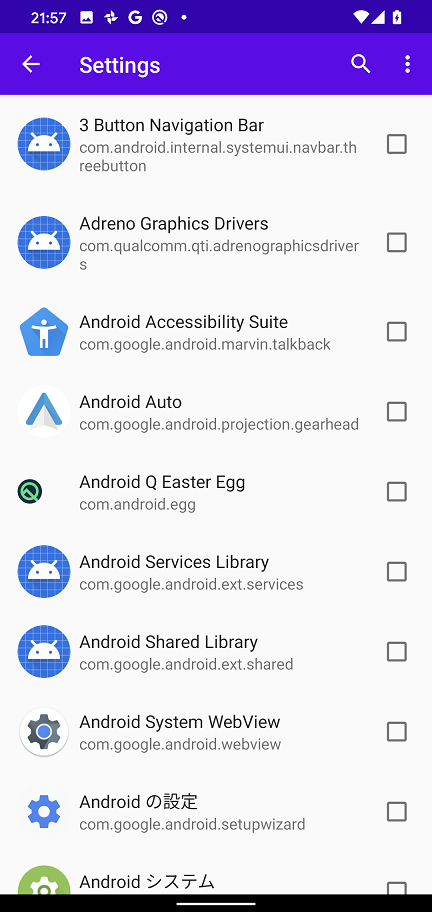

Android 通信 Proxy 設定ツール
=============

Language/[English](https://github.com/raise-isayan/TunProxy/blob/master/Readme.md)

このツールは、Android の VPNService 機能を利用した Proxy 設定ツールです。
指定したアプリからの通信のみを取得することが可能です。

Android 7.0 以降において、アプリはデフォルトではユーザ証明書を信頼しなくなっています。

* https://android-developers.googleblog.com/2016/07/changes-to-trusted-certificate.html

## 使用方法

ユーザ証明書領域に信頼させたい Root CA がない場合はインストールします。

TunProxyアプリを起動すると以下の画面が起動します。

* Proxy address (host:port)
   * 接続先のプロキシサーバを **IPアドレス:ポート番号** の形式で指定します。
     IPアドレスはIPv4形式で記載する必要があります。

* [Start] ボタン
    * 接続を開始します。
* [Stop] ボタン
    * 接続を停止します。

## メニュー

画面上部のメニューアイコン()からアプリケーションの設定ができます。

### Settings

VPNの接続設定を行います。

 ⇒ 

Disallow Application と Allow Application の２つのモードがありますが、同時に指定することはできません。
このためどちらのモードで動作させたいかを選択する必要があります。
デフォルトは **Disallow Application** が選択された状態です。

* Disallow Application
  * VPN通信から除外したいアプリを選択する。
    選択したアプリはVPN通信を経由されなくなり、VPNを利用しない場合と同じ挙動となります。

* Allow Application
  * VPN通信を行いたいアプリを選択する。
    選択したアプリはVPN通信を経由するようになります。
    選択されていないアプリは、VPNを利用しない場合と同じ挙動になります。
    なお、一つも選択されていない場合は、すべてのアプリの通信がVPNを経由します。

### About
アプリケーションバージョンを表示します。

## 動作環境 

* Android 5.0 (API Level 21) 以降

## 謝辞

アプリ作成にあたりコードの大部分は以下のアプリをベースとして作成しました。

* forked from MengAndy/tun2http
    * https://github.com/MengAndy/tun2http/

## 開発環境

* JRE(JDK) 1.8以上(Oracle JRE) (http://www.oracle.com/technetwork/java/javase/downloads/index.html)
* AndroidStudio 3.2.1 (https://developer.android.com/studio/index.html)
