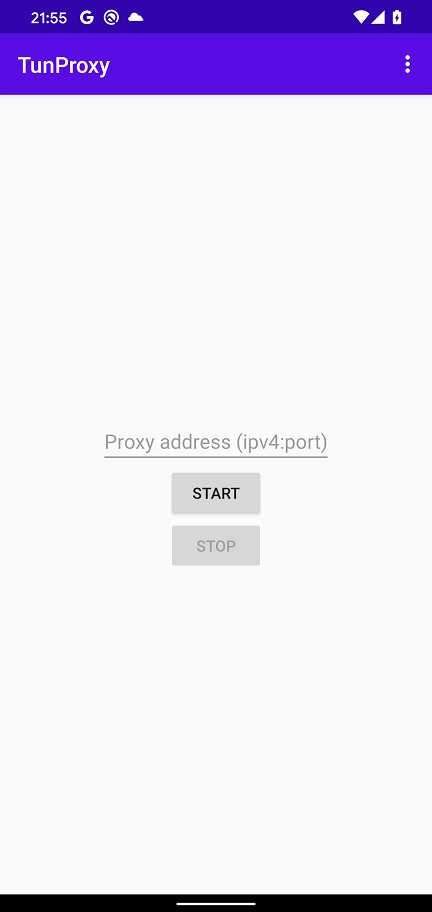
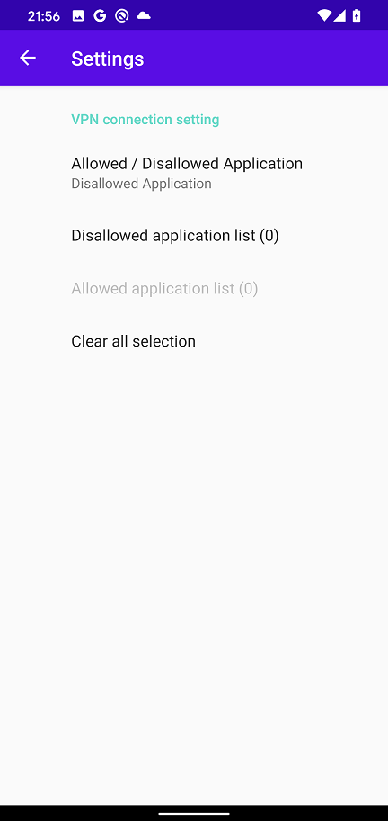
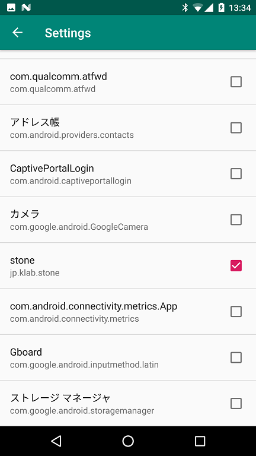

Android HTTP traffic Proxy setting tool
=============

Language/[Japanese](https://github.com/raise-isayan/TunProxy/blob/master/Readme-ja.md)

This tool is a proxy setting tool using Android VPNService.
It is possible to acquire only HTTP traffic from the specified application.

On Android 7.0 and later, the application no longer trusts user certificates by default.

* https://android-developers.googleblog.com/2016/07/changes-to-trusted-certificate.html

## how to use

If there is no Root CA you want to trust in the user certificate strage, install it.

When you start the TunProxy application, the following screen will be launched.

* Proxy address (host:port)
   * Specify the destination proxy server in the format ** IP address:port number **.
     The IP address must be described in IPv4 format.

* [Start] button
    * Start the VPN service.
* [Stop] button
    * Stop the VPN service.

## menu

Application settings can be made from the menu icon () at the top of the screen.

### Settings

Configure VPN service settings.

 => 

There are two modes, Disallow Application and Allow Application, but you can not specify them at the same time.
Because of this you will have to choose whether you want to run in either mode.
The default is * Disallow Application * selected.

* Disallow Application
  * Select the application you want to exclude from VPN service.
    The selected application will no longer go through VPN service and behave the same as if you do not use VPN.

* Allow Application
  * Select the application for which you want to perform VPN service.
    The selected application will now go through VPN service.
    Applications that are not selected behave the same as when not using VPN.
    In addition, if none of them are selected, communication of all applications will go through VPN.

### About
Display application version

## Operating environment 

* Android 5.0 (API Level 21) or later

## base application

Most of the code was created based on the following applications for creating applications.

* forked from MengAndy/tun2http
    * https://github.com/MengAndy/tun2http/

## Development environment

* JRE(JDK) 1.8以上(Oracle JRE) (http://www.oracle.com/technetwork/java/javase/downloads/index.html)
* AndroidStudio 3.2.1 (https://developer.android.com/studio/index.html)
