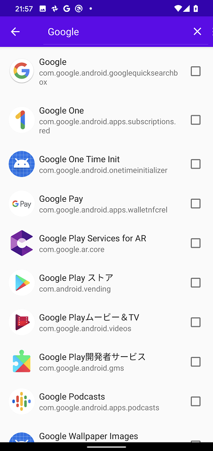
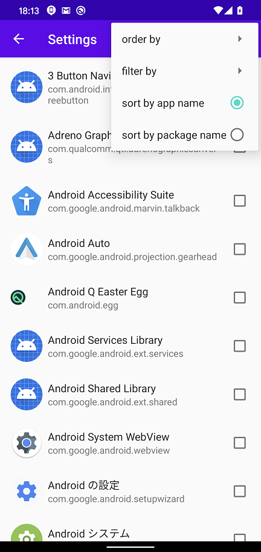

Android HTTP traffic Proxy setting tool
=============

Language/[Japanese](https://github.com/raise-isayan/TunProxy/blob/master/Readme-ja.md)

This tool is a proxy setting tool using Android VPNService.
It is possible to acquire only HTTP traffic from the specified application.

## how to use

When you start the TunProxy application, the following screen will be launched.

* Proxy address (host:port)
  * Specify the destination proxy server in the format **IP address:port number**.
    The IP address must be described in IPv4 format.

* [Start] button
  * Start the VPN service.
* [Stop] button
  * Stop the VPN service.

## menu

Application settings can be made from the menu icon () at the top of the screen.

### Settings

Configure VPN service settings.

 ⇒ 

There are two modes, Disallowed Application and Allowed Application, but you can not specify them at the same time.
Because of this you will have to choose whether you want to run in either mode.
The default is **Disallowed Application** selected.

* Disallowed Application
  * Select the application you want to exclude from VPN service.
    The selected application will no longer go through VPN service and behave the same as if you do not use VPN.

* Allowed Application
  * Select the application for which you want to perform VPN service.
    The selected application will now go through VPN service.
    Applications that are not selected behave the same as when not using VPN.
    In addition, if none of them are selected, communication of all applications will go through VPN.

### Settings Search

 / 

You can narrow down the applications from the search icon.()
Only applications that contain the keyword specified in the application name are displayed.

The application list can be sorted from the menu icon  () at the top of the screen.

* sort by app name
  * Sort application list by application name

* sort by package name
  * Sort application list by package name

### MITM (SSL decrypt)

TunProxy does not perform SSL decryption. TunProxy acts like a transparent proxy.
To perform SSL decryption, set the IP of an SSL decryptable proxy such as Burp suite or Fiddler to the IP of TunProxy

The following are local proxy tools that can decrypt SSL.

* Burp suite
  * https://portswigger.net/burp

* Fiddler
  * https://www.telerik.com/fiddler

* ZAP Proxy
  * https://www.owasp.org/index.php/OWASP_Zed_Attack_Proxy_Project

To decrypt SSL, install the local proxy tool Root certificate in the Android device user certificate.
However, in Android 7.0 and later, the application no longer trusts user certificates by default.

* https://android-developers.googleblog.com/2016/07/changes-to-trusted-certificate.html

Please refer to the following web site as a solution

* Android 7 Nougat and certificate authorities
  * https://blog.jeroenhd.nl/article/android-7-nougat-and-certificate-authorities

### About
Display application version

## Operating environment

* Android 5.0 (API Level 21) or later

## base application

Most of the code was created based on the following applications for creating applications.

* forked from MengAndy/tun2http
  * https://github.com/MengAndy/tun2http/

## Development environment

* JRE(JDK) 1.8以上(Oracle JRE) (http://www.oracle.com/technetwork/java/javase/downloads/index.html)
* AndroidStudio 3.4.2 (https://developer.android.com/studio/index.html)
